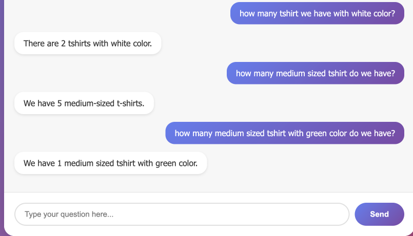
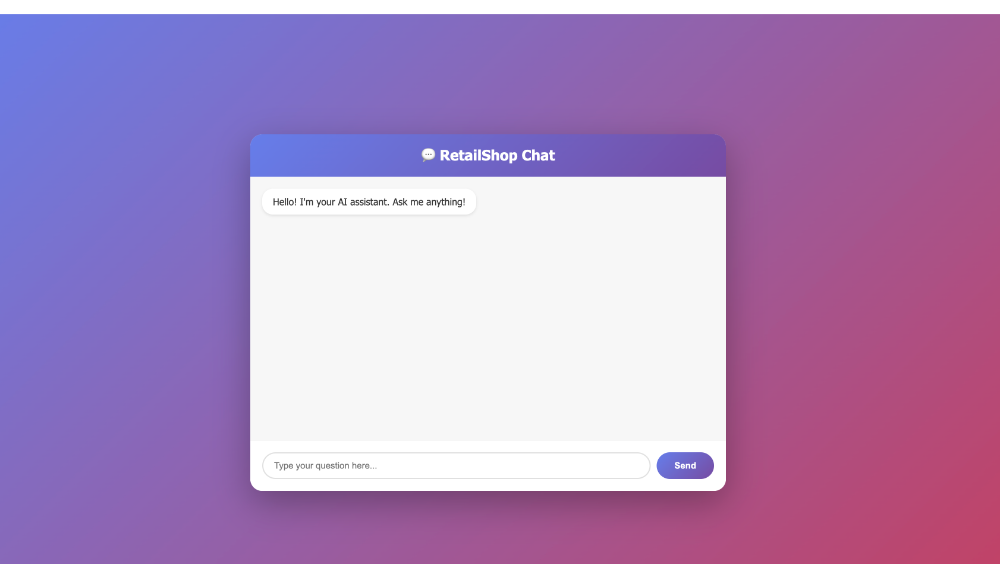
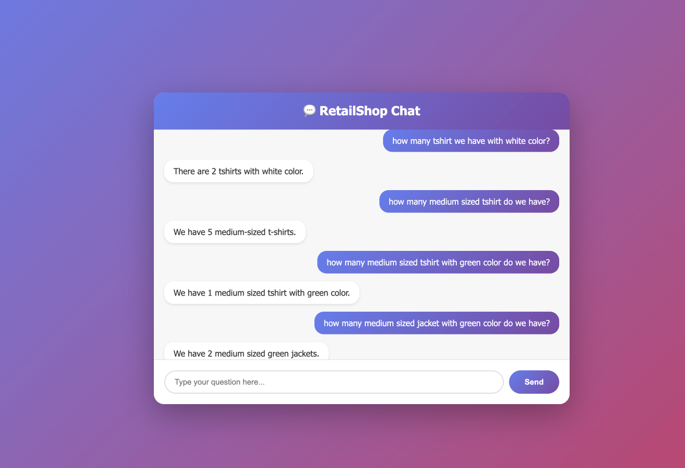
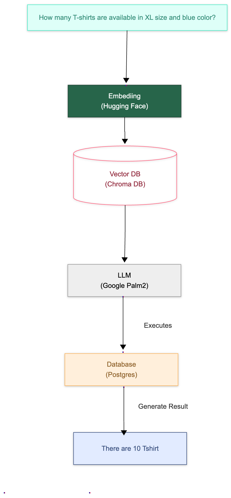

# Retail Shop Bot

An intelligent chatbot that provides information about retail shop products, discounts, and inventory using natural language processing and SQL database integration. It enables real-time communication about shop information.

## Snapshots





## Features

- Natural language query processing for retail shop information
- Integration with Google's Generative AI
- Few-shot learning for better query understanding
- PostgreSQL database integration
- Real-time chat interface


## Prerequisites

- Python 3.13+
- PostgreSQL database
- Google API Key for Generative AI

## Environment Setup

1. Clone this repository
```bash
git clone https://github.com/viperthapa/Retail-Shop-Bot
cd Retail-Shop-Bot
```

2. Create and activate a virtual environment:
```bash
# Create virtual environment
python3 -m venv my-env

# Activate (use the appropriate command for your shell)
# On macOS/Linux:
source my-env/bin/activate
# On Windows:
my-env\Scripts\activate
```

3. Install dependencies using uv or pip:
```bash
# Option 1: Using uv (recommended)
python -m pip install uv
uv pip install --upgrade pip setuptools wheel
uv sync

# Option 2: Using pip (if uv sync fails)
python -m pip install --upgrade pip setuptools wheel
python -m pip install -r requirements.txt
```

4. Install uvicorn for the development server:
```bash
python -m pip install "uvicorn[standard]"
```

3. Configure environment variables in `.env`:
```env
DB_USERNAME=your_username
DB_PASSWORD=your_password
DB_HOST=localhost
DB_PORT=5432
DB_NAME=your_db_name
GOOGLE_API_KEY=your_google_api_key
```

## Project Structure

```
retail-app/
├── app/
│   ├── create_sample_data.py  # Sample data generation
│   ├── database.py            # Database configuration
│   ├── few_shots.py          # Few-shot learning examples
│   ├── langchain_helper.py   # LangChain integration
│   ├── models.py             # SQLAlchemy models
│   └── schemas.py            # Pydantic schemas
├── static/
│   └── css/
│       └── style.css         # Custom styling
├── templates/
│   └── chat.html            # Chat interface
├── main.py                  # FastAPI application
├── pyproject.toml           # Project configuration
└── .pre-commit-config.yaml  # Pre-commit hooks config
```

## Development

1. Start the FastAPI server:
```bash
# Make sure your virtualenv is activated
python -m uvicorn main:app --reload
```

2. Access the chat interface at `http://localhost:8000`


## Code Quality

The project uses several pre-commit hooks for code quality:

- isort: Python import sorting
- black: Code formatting
- ruff: Python linter


## Database Setup

The application automatically:
1. Creates necessary database tables on startup
2. Checks for existing data
3. Loads sample data if the database is empty

## How It Works

1. User submits a question through the chat interface
2. FastAPI processes the request
3. LangChain helper uses few-shot learning and Google's Generative AI to:
   - Understand the question
   - Generate appropriate SQL queries
   - Process database results
4. Response is formatted and returned to the user
5. Chat interface updates with the answer


